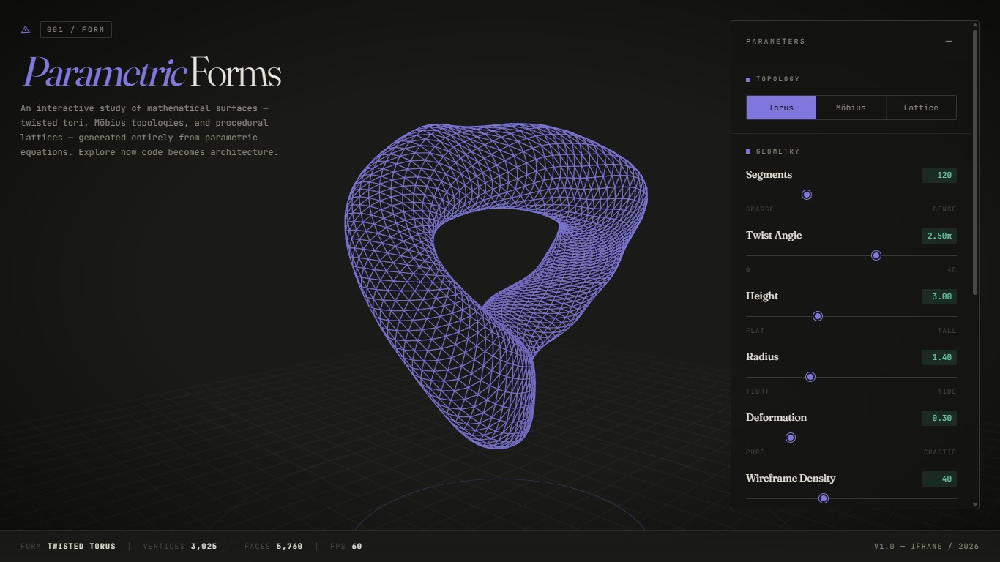
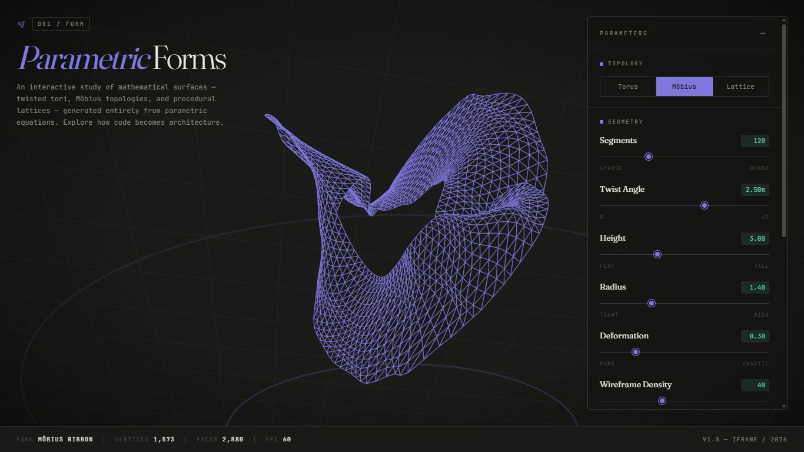
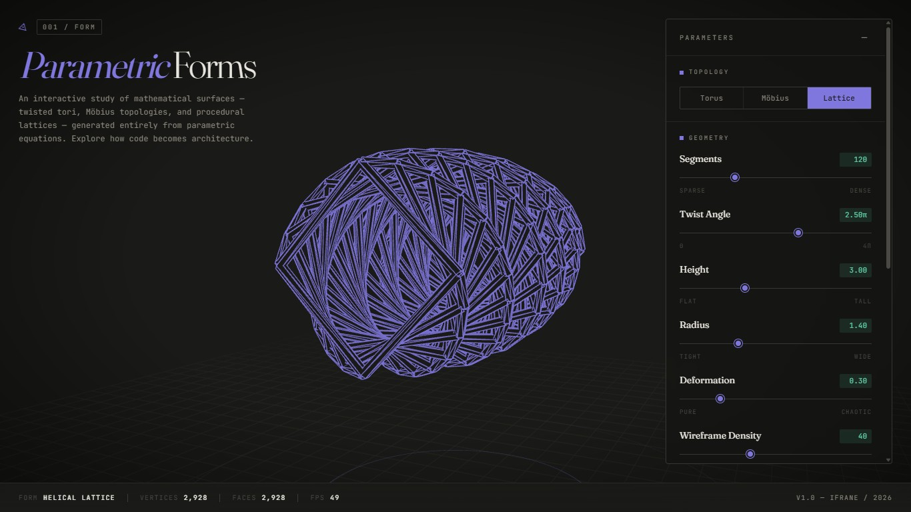

# Parametric Forms , Computational Design Studio

> An interactive 3D parametric form generator exploring mathematical surfaces as the basis for architectural geometry. Built with Three.js, no build tools, no dependencies beyond a CDN.

---

## Design Intent

Computational architecture treats **form as a function** rather than a fixed object. Where a traditional drawing fixes a geometry, a parametric model encodes the *rules* of a geometry , and lets those rules vary continuously across a design space.

This project is a small, self-contained study in that idea. The user does not place vertices; they manipulate a small set of mathematical parameters , twist, radius, segmentation, deformation , and watch a continuous family of forms emerge from a closed-form equation. The same six sliders can produce a tight twisted torus, a procedural diagrid tower, and a Möbius ribbon, because all three are expressions of the same underlying paradigm: **parametric surfaces sampled and tessellated in real time on the GPU.**

The aesthetic is deliberately editorial , a computational lab, not a game. Dark canvas, surgical typography, restrained motion.

---

## The Mathematics

Three topologies are implemented from scratch in `geometry.js`. All are sampled on a parameter grid `(u, v) ∈ [0, 2π] × [0, 2π]` and tessellated into an indexed triangle mesh.

### 1. Twisted Torus

A torus whose tube is rotated about its sweep axis as it travels around the major loop. The number of full twists is controlled by `τ` (the **twist angle** parameter).

$$
\begin{aligned}
x(u,v) &= \big(R + r \cos(v + \tau u)\big) \cos(u) \\
y(u,v) &= \big(R + r \cos(v + \tau u)\big) \sin(u) \\
z(u,v) &= r \sin(v + \tau u) + h \sin(2u)
\end{aligned}
$$

where `R` is the major radius (sweep), `r = 0.4·R` is the tube radius, `h` modulates vertical undulation, and `τ` is the twist constant. When `τ = 0` this collapses to a standard torus; as `τ` grows the cross-section spirals , geometry familiar to anyone who has studied Frank Gehry's twisted columns or the Mercedes-Benz Museum.

### 2. Möbius-Inspired Ribbon

A generalised Möbius strip extended into a ribbon, with multiple half-twists controlled by `n = τ/π`:

$$
\begin{aligned}
x(u,v) &= \big(R + v \cos(\tfrac{u}{2} \cdot n)\big) \cos(u) \\
y(u,v) &= \big(R + v \cos(\tfrac{u}{2} \cdot n)\big) \sin(u) \\
z(u,v) &= v \sin(\tfrac{u}{2} \cdot n) + h \sin(u \cdot n)
\end{aligned}
$$

with `u ∈ [0, 2π]` and `v ∈ [-w, w]`. For `n = 1` this is a classical single-sided Möbius surface; for higher `n`, a multiply-twisted ribbon emerges , single-sided architectural surfaces have appeared in projects from Foster's Möbius House to Zaha Hadid's Heydar Aliyev Center.

### 3. Procedural Helical Lattice

Not a smooth surface but a **structural diagrid**: two or more interlocking helices joined by horizontal struts, each strut tessellated as a small cylinder. For helix `k` of `K` total strands and parameter `t ∈ [0, 1]`:

$$
\begin{aligned}
R(t) &= R_0 \cdot \big(1 - \delta \cdot (2t - 1)^2 \big) \\
\theta(t, k) &= 2\pi n t + \tfrac{k}{K} 2\pi + \delta \sin(4\pi t) \\
x(t, k) &= R(t) \cos\theta \\
y(t, k) &= R(t) \sin\theta \\
z(t)   &= H(t - 0.5)
\end{aligned}
$$

where `n` is the number of full revolutions over the height, `H` is the total height, and `δ` is the deformation parameter , which here barrels the radius outward at the midspan and adds a sinusoidal sway. This is the geometric grammar of Foster's 30 St Mary Axe, the Hearst Tower diagrid, and countless tall-building exoskeletons.

### Deformation Field

All three topologies share a noise-perturbed deformation step controlled by the **Deformation** slider. A deterministic pseudo-noise is sampled at each vertex:

$$
N(x, y, z) = \tfrac{1}{2} \sin(1.7x + 2.3y + 1.1z) + \tfrac{3}{10} \cos(2.9x - 1.3y + 2.7z) + \tfrac{1}{5} \sin(3.7(x + y + z))
$$

and added back to the vertex position with a magnitude proportional to the deform parameter. The function is deterministic, so identical parameter inputs always produce identical exported geometry , important for reproducibility.

---

## Why This Matters for Architectural Computation

Three things make this small study a useful exercise for graduate-level computational architecture:

**Form as algorithm.** Every shape you see is a closed-form equation. There is no static model file. Changing a parameter rebuilds the entire mesh in milliseconds. This is the core mental shift from CAD to computational design , geometry as the *output* of code rather than its *input*.

**Continuous design spaces.** With six sliders you can traverse an effectively infinite family of forms. This is the foundation of generative design, optimisation under constraints, and machine-learning-driven form-finding. The randomise button is a primitive sampler over that space.

**Tessellation and digital fabrication.** The OBJ and STL exporters mean any form generated here can be sent directly to a 3D printer, CNC router, or downstream BIM tool. The bridge between a mathematical equation and a physical artefact is exactly the bridge that defines contemporary computational architecture practice , from Achim Menges's ICD/ITKE pavilions to the Zaha Hadid CODE group.

A Master's in architectural computation lives in this gap between formal language and built form. This project is a deliberate exercise in occupying that gap, in miniature.

---

## Live Demo

🔗 **Interactive Website:** https://mtaoumi.github.io/computational-design-studio/

Explore the parametric generator directly in your browser. Rotate the model, adjust sliders, switch topologies, and export generated forms.

---

## Screenshots

| Twisted Torus | Möbius Ribbon | Helical Lattice |
| :-: | :-: | :-: |
|  |  |  |

---

## Technical Stack

- **Three.js** `0.161.0` (loaded from unpkg via an ES module `importmap` , no bundler)
- **Vanilla JavaScript** (ES modules), **HTML5**, **CSS3**
- Three.js addons used:
  - `OrbitControls` , mouse drag / scroll to navigate the scene
  - `OBJExporter`, `STLExporter` , fabrication-ready exports
- Typography: **Fraunces** (display serif) + **JetBrains Mono** (technical text), via Google Fonts

There is **no build step**. Every file is shipped as-is.

---

## Run Locally

Because the project uses ES modules with an import map, it must be served over HTTP , a `file://` open in the browser will not work.

```bash
# Option 1 , Python
python3 -m http.server 8000

# Option 2 , Node (if you have it)
npx serve .

# Option 3 , VS Code Live Server extension
```

Then open `http://localhost:8000`.

---

## Project Structure

```
computational-design-studio/
├── index.html        # Entry point + import map + DOM scaffolding
├── style.css         # Editorial dark-mode stylesheet
├── main.js           # Three.js scene, lighting, render loop
├── geometry.js       # Parametric form generators (the mathematics)
├── controls.js       # Slider/preset/export wiring
├── README.md
└── .gitignore
```

---

---

## Controls Reference

| Control | What it does |
| --- | --- |
| **Topology** | Switch between the three parametric forms |
| **Segments** | Resolution along the major sweep direction |
| **Twist Angle** | Twist constant `τ` (in radians, displayed as multiples of π) |
| **Height** | Vertical scale factor |
| **Radius** | Major radius `R` |
| **Deformation** | Magnitude of noise perturbation `δ` |
| **Wireframe Density** | Resolution along the cross-sectional direction |
| **Render Mode** | Wireframe / Solid / X-Ray |
| **Presets** | Tower, Lattice, Twist , three curated parameter sets |
| **Randomise** | Sample a random point in parameter space |
| **Reset** | Return to default parameters |
| **Export .OBJ / .STL** | Download the current mesh for fabrication |

Mouse: **drag** to orbit, **scroll** to zoom.

---

## License

MIT. Use, fork, modify freely.

---

